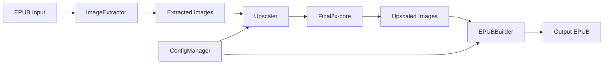

# ComicsUpscaler

A CLI tool that enhances image quality in EPUB ebooks for e-ink device readers using AI super-resolution (RealCUGAN/RealESRGAN) via Final2x-core.

## Demo

```bash
$ python -m comics_upscaler.main

==================== 开始处理 [Kmoe][鏢人]話109-115.epub ====================

第1步: 提取图片
开始从EPUB提取图片...
书籍标题: 鏢人 - 話109-115
作者: 許先哲
已提取图片 1: image/moe-013610.jpg
...
EPUB处理完成，共提取 240 张图片
找到 240 张图片

第2步: 超分辨率图片
开始超分辨率处理...
使用模型: RealCUGAN_Conservative_2x.pth
放大倍数: 2x
并行进程数: 3
图片总数: 240
分成 3 批处理
...

==================== 处理完成 ====================
输出文件: /path/to/output/[Kmoe][鏢人]話109-115.epub

文件大小对比:
- 原始文件: 101.3 MB
- 处理后文件: 395.5 MB
- 增大比例: 290.3%
```

## Features

### Implemented (v1.0)
- EPUB format ebook processing
- AI super-resolution using RealCUGAN/RealESRGAN models
- Automatic image resizing for e-ink displays
- Preservation of original ebook metadata and structure
- Batch processing multiple files
- Multi-process parallel processing
- Automatic temp file cleanup
- Native macOS support (Apple Silicon & Intel)

### Planned (v2.0)
- [PLACEHOLDER: GUI interface]
- [PLACEHOLDER: Windows support]
- [PLACEHOLDER: PDF input support]
- [PLACEHOLDER: Custom model upload]

## Architecture

The tool consists of four main components: ImageExtractor parses EPUBs and extracts images, Upscaler manages Final2x-core processes for AI enhancement, EPUBBuilder reconstructs ebooks with processed images, and ConfigManager handles settings. Data flows from EPUB → extracted images → upscaled images → repackaged EPUB.



## Setup

### Prerequisites
- macOS 10.15+ (Apple Silicon or Intel)
- Python 3.8-3.12
- 8GB+ RAM
- [Final2x-core](https://github.com/Tohrusky/Final2x-core/releases) binary

### Quick Start

```bash
# Clone repository
git clone https://github.com/HY-D1/comics-upscaler-mac.git
cd comics-upscaler-mac

# Install dependencies
pip install -r requirements.txt

# Setup Final2x-core
mkdir -p Final2X
cd Final2X
curl -L -o Final2x-core-macos-arm64.7z "https://github.com/EutropicAI/Final2x-core/releases/download/2024-12-14/Final2x-core-macos-arm64.7z"
brew install p7zip
7z x Final2x-core-macos-arm64.7z
chmod +x Final2x-core
cd ..

# Configure and run
vim comics_upscaler/config/settings.yaml
python -m comics_upscaler.main
```

### Run Tests

```bash
[PLACEHOLDER: Test commands not provided]
```

### Configuration

Edit `comics_upscaler/config/settings.yaml`:

```yaml
temp_dir: "/path/to/temp"

directories:
  input: "/path/to/epubs"
  output_suffix: "_upscale"

upscale:
  model_name: "RealCUGAN_Conservative_2x.pth"
  scale: 2
  target_long_edge: 2400
  num_processes: 3
  output_format: "JPEG"
  output_quality: 95

epub:
  resize_to_original: false
  create_new: false
  create_eink: false
```

## API Reference

N/A

## Data Model / Schema

N/A

## Trade-offs & Design Decisions

- **Chose:** Multi-process parallel processing with 3 concurrent workers
- **Gave up:** Higher memory efficiency and thermal headroom
- **Why:** M1 Pro has 10 cores (8P+2E); using 3 processes balances throughput while leaving resources for system tasks

- **Chose:** 2x upscaling as default (vs 4x)
- **Gave up:** Maximum image quality
- **Why:** 2x provides 2-3 sec/page vs 8-12 sec/page for 4x; acceptable quality improvement for e-ink display constraints

## Limitations
- Requires Final2x-core binary (not bundled)
- macOS only (this fork; original Windows version available)
- Processing requires ~10x input file size in disk space
- No GPU acceleration on Intel Macs

## Next Steps
- [PLACEHOLDER: Add GUI interface]
- [PLACEHOLDER: Optimize memory usage for large batches]
- [PLACEHOLDER: Support additional input formats (PDF, CBZ)]
